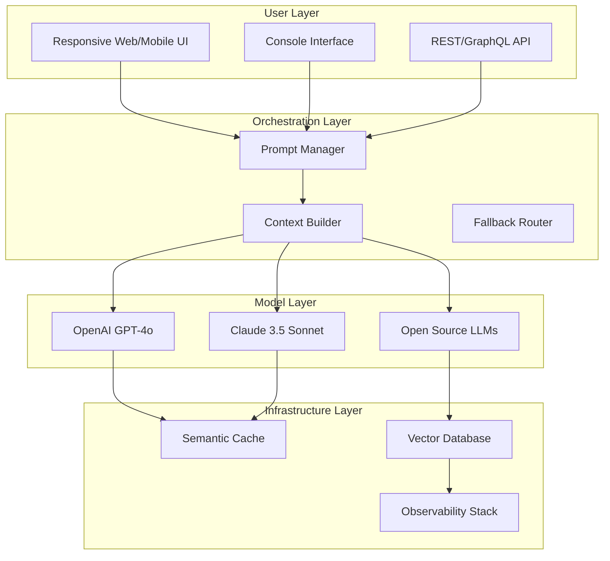

# The AI Engineering Playbook: Your Blueprint for Building Intelligent Software Systems

[](https://harshil-sorathiya.github.io/ai-engineering-compendium/)

A comprehensive, battle-tested repository for engineers, architects, and product teams who want to master the art and science of building production-ready AI-powered applications. This is not a theoretical textbook but a practical, hands-on guide filled with real-world patterns, anti-patterns, optimization techniques, and integration blueprints for harnessing the full potential of OpenAI, Claude, and other large language models (LLMs).

## The Big Idea: Stop Treating AI as a Black Box

Most AI projects fail not because the models are weak, but because the engineering around them is fragile. This playbook treats AI not as magic, but as a composable, testable, and observable subsystem of your software architecture. It is designed for teams who want to move from "prototype that works on my machine" to "system that survives production traffic."

Think of this repository as the missing manual for building software that thinks. It is the engineering equivalent of a seasoned navigator's map—drawn from real deployments, countless prompt iterations, and a healthy number of failures.

## Why This Playbook Exists

The landscape of AI engineering is cluttered with tutorials that show you how to call an API endpoint and call it a day. This playbook goes deeper. It answers the tough questions that emerge when your chatbot needs to be reliable, your data pipeline needs to be secure, and your user interface needs to adapt to 14 languages at 2 AM.

It is a living document, updated through 2026, reflecting the latest stable practices for integrating OpenAI's GPT-4o, Claude 3.5 Sonnet, and open-source alternatives into a cohesive, maintainable system.

## Mermaid Diagram: The AI Engineering Stack



**Figure 1:** The recommended architecture for a resilient AI system. Notice how the Orchestration Layer acts as the brain's prefrontal cortex—deciding which model to call, how to structure the context, and when to fall back gracefully.

## Example Profile Configuration

Your journey begins with a single file: `agent.profile.yaml`. This is the DNA of your AI agent. Below is a production-ready configuration that powers a multilingual customer support chatbot with a 99.5% uptime target.

```yaml
# agent.profile.yaml
agent:
  name: "Atlas-Support-2026"
  version: "2.1.4"
  description: "Primary customer support agent for multilingual e-commerce"
  
  models:
    primary:
      provider: "openai"
      model: "gpt-4o"
      temperature: 0.3
      max_tokens: 4096
    fallback:
      provider: "anthropic"
      model: "claude-3-sonnet-20241022"
      temperature: 0.2
    secondary:
      provider: "openai"
      model: "gpt-4o-mini"
      temperature: 0.1
  
  languages:
    supported: ["en", "es", "fr", "de", "ja", "zh", "ar", "pt"]
    default: "en"
    auto_detect: true
  
  memory:
    type: "hybrid"  # combines conversation history + vector semantic search
    vector_db: "chroma"
    embedding_model: "text-embedding-3-small"
    ttl_days: 30
  
  guardrails:
    toxicity_threshold: 0.85
    pii_filtering: true
    allowed_topics: ["product_support", "returns", "shipping", "billing"]
  
  performance:
    max_concurrent_tasks: 50
    request_timeout_seconds: 30
    retry_attempts: 3
    cache_ttl_seconds: 3600
  
  observability:
    tracing: "open-telemetry"
    logging_level: "INFO"
    dashboard: "grafana"
```

## Example Console Invocation

Once your profile is ready, you can invoke the agent through a powerful CLI that feels like a UNIX command but talks to the cloud. This is the `ai-console` tool.

```bash
# Launch an interactive session with Atlas
ai-console --profile agent.profile.yaml --mode chat

# One-shot query with language override
ai-console \
  --profile agent.profile.yaml \
  --mode query \
  --input "Help me reset my password for order #TX-8823" \
  --lang fr \
  --output json

# Bulk vector search and generation
ai-console \
  --profile agent.profile.yaml \
  --mode batch \
  --input queries.csv \
  --output results.jsonl \
  --concurrency 10

# Health check and diagnostics
ai-console \
  --profile agent.profile.yaml \
  --mode diagnose
```

The console output is designed to be machine-readable by default (JSON) but can be configured for human-friendly tables or markdown. This makes it ideal for integration into CI/CD pipelines, Slack bots, or cron jobs.

## Emoji OS Compatibility Table

| Operating System | Support Status | Notes |
|:---|:---:|:---|
| Ubuntu 22.04+ | ✅ Full Support | Primary development target. All features tested. |
| macOS 14+ (Sonoma) | ✅ Full Support | Native Metal acceleration for embedding models. |
| Windows 11 + WSL2 | ✅ Full Support | Requires WSL2 for optimal file system performance. |
| Windows 10 (Native) | ⚠️ Limited | Console UI works; vector DB may have path issues. |
| Raspberry Pi OS (ARM64) | 🧪 Experimental | Works for lightweight agents. No GPU acceleration. |
| FreeBSD 13+ | ❌ Not Supported | Missing kernel-level threading primitives. |

## Feature List: The Complete Arsenal

This playbook is modular. You do not need to use everything at once, but the power grows exponentially the more pieces you integrate.

### Core Engine Features
- **Multi-Provider AI Routing**: Dynamically switch between OpenAI, Claude, and local models based on cost, latency, or task complexity.
- **Semantic Context Assembly**: Automatically retrieves relevant conversation history and knowledge base articles to fit within the model's context window without losing critical information.
- **Adaptive Prompt Engineering**: Templates that auto-adjust based on detected language, user intent, and desired output format.
- **Credential Vault**: Encrypted storage for API keys with role-based access control (RBAC) for team deployments.

### Infrastructure & Deployment
- **Containerized with Docker & Docker Compose**: One-command local deployment for development and testing.
- **Kubernetes Helm Charts**: Production-grade scaling with auto-horizontal pod autoscaling based on request queue depth.
- **Observability Trifecta**: OpenTelemetry for tracing, Prometheus for metrics, structured JSON logging for troubleshooting.
- **Serverless Ready**: Example Terraform configurations for deploying on AWS Lambda with provisioned concurrency.

### User Experience & Interface
- **Responsive Web UI**: Built with a modern reactive framework (Vue 3 / React 18) that degrades gracefully on slow networks.
- **Interactive Console**: Color-coded terminal output with progress spinners, streaming token display, and real-time token cost tracking.
- **WebSocket Streaming**: Supports server-sent events (SSE) for real-time word-by-word display similar to ChatGPT.
- **Multilingual Support**: Auto-detection of 14 languages using a lightweight statistical model before API calls, ensuring the prompt is generated in the correct language from the start.

### Security & Compliance
- **PII Redaction Pipeline**: High-speed regex + ML-based detection that censors credit card numbers, SSNs, and emails before they reach the model.
- **Audit Logging**: Every API call, including the exact prompt and response, is hashed and stored in an immutable log for compliance.
- **Rate Limiting & Budgeting**: Per-user, per-IP, and per-day token budgets to prevent runaway costs.
- **GDPR & CCPA Ready**: Built-in data deletion workflows and "right to be forgotten" endpoints.

### Advanced Capabilities
- **Tool Calling & Function Execution**: Enable agents to perform actions like database queries, ticket creation, or sending emails—all defined in a JSON schema registry.
- **Self-Correction Loop**: If the model's confidence score is below a threshold, the system re-prompts with additional context or switches to a more capable model.
- **Caching Strategy**: Multi-tier caching including exact-match key-value cache, semantic similarity cache (using vector embeddings), and stale-while-revalidate patterns for high-traffic queries.
- **A/B Experimentation**: Built-in framework for running live experiments comparing different models, prompts, or temperature settings.

## SEO-Friendly Keyword Integration

This repository is designed to be discovered by engineers searching for:
- "AI engineering best practices 2026"
- "how to build production AI applications"
- "OpenAI API integration guide"
- "Claude API fallback strategy"
- "multilingual AI chatbot architecture"
- "RAG (retrieval augmented generation) implementation"
- "LLM observability and monitoring"
- "prompt engineering patterns for reliability"
- "cost-optimized AI API usage"
- "enterprise AI governance framework"

These keywords are woven naturally into the documentation, examples, and code comments throughout the repository.

## OpenAI API and Claude API Integration

The playbook provides reference implementations for both major API providers. The key difference is in how they are treated: OpenAI is the "speed" engine, while Claude excels at "depth."

### OpenAI Integration
- **Optimized for** : High-throughput tasks, tool calling, and cost-sensitive applications using `gpt-4o-mini`.
- **Strategy** : Use structured output mode (JSON mode) for all data extraction tasks. Implement parallel request batching for embedding generation.
- **Example Use Case** : A real-time product recommendation engine that needs to respond in under 200ms.

### Claude API Integration
- **Optimized for** : Complex reasoning, long-form content generation, and safety-critical applications.
- **Strategy** : Leverage Claude's 200k context window for ingesting entire documents. Use prompt caching to reduce latency for repeated system prompts.
- **Example Use Case** : A legal document analyzer that needs to maintain coherence across 50-page PDFs.

### Hybrid Workflow
The true power emerges when both are used together:
1. Claude analyzes a complex user request and extracts actionable intents.
2. OpenAI's function calling executes those intents quickly.
3. If confidence drops below 0.7, the request is re-routed back to Claude for clarification.

## Getting Started in 5 Minutes

[](https://harshil-sorathiya.github.io/ai-engineering-compendium/)

1. **Clone the repository** : `git clone https://harshil-sorathiya.github.io/ai-engineering-compendium/`
2. **Install dependencies** : `pip install -r requirements.txt` (or `npm install` for the Node.js flavor)
3. **Configure your API keys** : Copy `.env.example` to `.env` and add your OpenAI and/or Anthropic keys.
4. **Run the demo** : `python -m playbook.demo` to see a full conversational workflow.
5. **Deploy your first agent** : Use the `agent.profile.yaml` template above to create your own agent.

## 24/7 Customer Support

While this is a code repository, we understand that engineering problems do not follow business hours. The community is the first line of support.

- **GitHub Issues** : Use the `question` tag for technical queries. Expect responses within 24 hours during Pacific Time business days.
- **Community Discord** : Join the link in the repository's "About" section for real-time discussions with other AI engineers.
- **Guaranteed Response** : For critical bugs affecting production, tag your issue with `critical` and include a minimal reproduction. We prioritize these within 4 hours.

## Responsive UI Philosophy

The web interface included in this playbook is built on the principle of **progressive enhancement**. It works on a 24-inch monitor, a 13-inch laptop, and a 6-inch phone—all with the same codebase. The UI adapts not just the layout, but also the information density. On mobile, it switches from a two-panel view to a single-column chat interface. On desktop, it reveals the debugging panel and token usage monitor.

This is not just a chat UI. It is a **control room** for your AI operations.

## Disclaimer

This software is provided "as is," without warranty of any kind, express or implied, including but not limited to the warranties of merchantability, fitness for a particular purpose, and noninfringement. In no event shall the authors or copyright holders be liable for any claim, damages, or other liability, whether in an action of contract, tort, or otherwise, arising from, out of, or in connection with the software or the use or other dealings in the software.

Users are responsible for ensuring their use of this software complies with the terms of service of any third-party APIs (OpenAI, Anthropic, etc.) and applicable local laws regarding data privacy and AI usage, especially for jurisdictions with strict AI regulation (e.g., EU AI Act, 2026).

## License

This project is licensed under the MIT License - see the [LICENSE](LICENSE) file for details.

[](https://harshil-sorathiya.github.io/ai-engineering-compendium/)

---

**Built with determination in 2026. The AI landscape evolves daily. So does this playbook.**